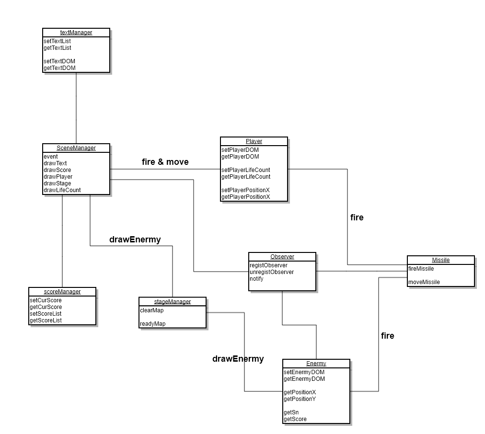

# Galaga (ver.prototype)
## 기술스택(Tech Stack)
### Language & Server & Framework
`Node.js` v14.15.0  
`webpack` v4.44.2  
`Language` Javascript(es6), Scss

## 설계(Design)

### CheckList
- [x] Webpack 설정
- [x] Javascript ES6, SCSS 적용
- [x] 뷰와 데이터는 분리되어 작동하기
- [x] 객체간 통신은 메서드를 통해 동작
- [x] 적합한 패턴을 적용하기(Singleton, Obersever)
- [ ] 변경에 유연한 코드작성

### Feedback & Review
- `객체간 단일관계 통신`은 설계 및 구현이 굉장히 편했다. 각 객체는 데이터를 들고 화면에 보여지는 모든 동작은 SceneManager에서 관리하게 했는데, 그려지는 순서, 데이터 관리가 매우 편리했다.

- `옵저버, 싱글톤 패턴적용` 가끔 클래스 계층을 건너띄고 발생하는 이벤트의 전파를 간단하게 관리할수 있어서 개발하는데 있어서 많은 도움이 되었다. `주의할점`은 `notify` 가 실행되는 시점에서 this 는 해당 호출부 this이기 때문에 반드시 bind 시켜줘야함

- `이벤트의 책임은 누구에게?` Galaga 게임은 Player가주로 이벤트를 가지고 있다. 하지만 SceneManager가 모든 화면을 관리하고 있기떄문에 다른 객체이벤트도 SceneManager에서 관리해주는게 맞다는 생각이 들었는데 구현하며 편리성 & 이론의 트레이드오프는 항상 마음속 물음표를 던지게 되는 행위였다.

- `Player & Enermy 차이` 설계과정에서 제일 난감했던 부분이였다. 게임은 Player가 주도적으로 이끌어나간다는 생각으로 Enermy와 분리하였는데 구현의 내용을 놓고보면 하는행동이 같아 같은 Space 라는 클래스로 묶어서 표현이 가능했을거같아 많이 아쉬웠다.
Player를 분리하는건 확장성을 생각해서 나뉘게 되었는데 부족함과 아쉬움을 많이 느낀 부분이였다.

- `View, Data 의 분리` SceneManager에서 모든 뷰를 관리하는 부분은 단점도 존재하지만 장점이 많은것 같다. Player 의 좌표정보, stageManager가 들고있는 Enermy의 데이터로 화면을 바로바로 구성할수 있어서 좋았다. 마음속의문은 Enermy가 생성되는 시점에 Missile을 그리는건 SceneManager가 어디까지 관리를 해줘야하는지 궁금했다. 중간에 Observer 가 관리를 해줄순 있었지만 SceneManager 를 거치지않아도 부분적으론 객체 스스로 해결할수 있는 문제들은 트레이드오프가 있는것 같다.

- `변경에 유연하지 않은 코드` 실무에서도 날 붙잡는 가장어려운 부분인것 같다. 객체는 최대한 메소드만으로 행동하게 하고 객체는 각각의 자율성을 보장하려 노력하지만 계층이 생길수록 설계에있어 부족함이 현저히 느껴지는 토이프로젝트였다. 부족한 부분을 알수있게되어 좋은기회였고 방향도 나름 알수있는 좋은기회였다.